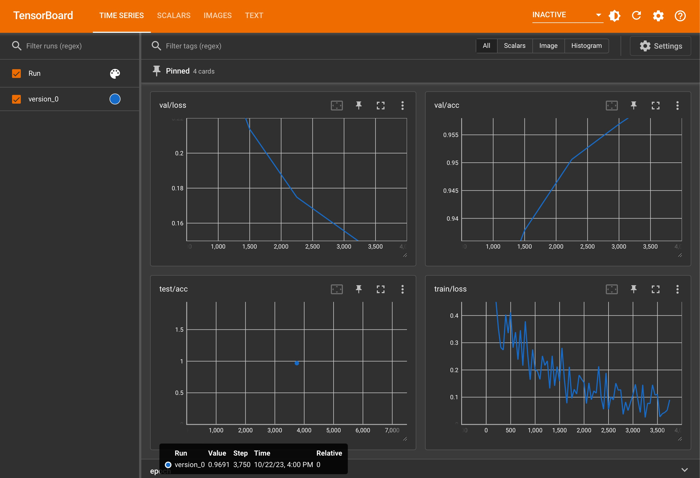

# Creating an MNIST Classifier with PyTorch Lightning

Basic image classification using the MNIST handwritten digit dataset is a solved problem in 2023, but this makes it perfect for learning some new techniques like PyTorch Lightning, which promises to standardize, simplify, and accelerate the way we create models with PyTorch. The MNIST dataset consists of handwritten digits from 0 through 9, and we should expect pretty high accuracy (>90%) despite training a new model from scratch. We’ll use this problem to implement PyTorch Lightning. I’ll walk through my super simple implementation, and all of the code we write will be contained in just two files: one for setting up the data and one for setting up and training the model.

# Setting Up the Environment

Our core dependencies will by PyTorch and PyTorch Lightning, but we’ll also use TorchMetrics and TensorBoard for calculating and visualizing metrics, images, text and other data as we train and test our model.

```bash
pip install torch torchvision  # PyTorch
pip install lightning  # PyTorch Lightning
pip install torchmetrics  # TorchMetrics
pip install tensorboard  # TensorBoard
```

# MNIST Data

The MNIST handwritten digit dataset consists of 60,000 training images and 10,000 test images. Each handwritten digit is a grayscale 28 px × 28 px image (i.e., 784 total pixels) and is directly available from `torchvision.datasets`.

.](Images/MnistExamplesModified.jpeg)

Sample images of handwritten digits from the MNIST database. [Image courtesy of Wikipedia](https://en.wikipedia.org/wiki/MNIST_database#/media/File:MnistExamplesModified.jpeg).

## `LightningDataModule`

All logic related to setting up the data is in `[DigitDataModule.py](https://github.com/sxg/PyTorch-Lightning-Quickstart/blob/main/DigitDataModule.py)`, which contains our custom `LightningDataModule` subclass. Let’s start from the top!

```python
import lightning.pytorch as pl
import torch
import torch.utils.data as data
from torchvision.datasets import MNIST
import torchvision.transforms as transforms

class DigitDataModule(pl.LightningDataModule):
    def __init__(self, batch_size=64):
        super().__init__()
        self.batch_size = batch_size
        # Setup the transforms
        self.transform = transforms.Compose(
            [
                transforms.ToTensor(),
                transforms.Normalize((0.5,), (0.5,)),
            ]
        )
...
```

After all the imports, we have our `DigitDataModule` subclass of `LightningDataModule` along with the `__init__()` method. We’ll initialize the data module with a default batch size of 64 and a couple of basic transforms. Because the MNIST handwritten digit classification is fairly simple, we don’t need to do any data augmentation or substantial image pre-processing. We’ll combine two transforms with the `transforms.Compose()` function, and we’ll start with `transforms.ToTensor()`, which converts the PIL (Python Image Library) `Image` to a PyTorch `Tensor` with values from 0 through 1. The second transform, `transforms.Normalize((0.5,) (0.5,))`, normalizes the grayscale values in the `Tensor` with a mean of 0.5 and standard deviation of 0.5 using this function:

$$
\text{Normalized Value} = \frac{\text{Unnormalized Value} - \text{Mean}}{\text{Standard Deviation}}
$$

This will change the values in the image tensor from 0 through 1 to −1 through 1, which can often help with model convergence. However, because our task is simple and uses 1-channel grayscale values, I didn’t find a huge difference between including and excluding the normalization transformation.

Up next, we have the `prepare_data()` and `setup()` methods:

```python
...
def prepare_data(self):
    MNIST("MNIST", train=True, download=True)
    MNIST("MNIST", train=False, download=True)

def setup(self, stage):
    if stage == "fit":
        full_set = MNIST(
            root="MNIST",
            train=True,
            transform=self.transform,
        )
        train_set_size = int(len(full_set) * 0.8)
        val_set_size = len(full_set) - train_set_size
        seed = torch.Generator().manual_seed(42)
        (
            self.train_set,
            self.val_set,
        ) = data.random_split(  # Split train/val datasets
            full_set, [train_set_size, val_set_size], generator=seed
        )
    elif stage == "test":
        self.test_set = MNIST(
            root="MNIST",
            train=False,
            transform=self.transform,
        )
...
```

`prepare_data()` is an appropriate place to download your data as PyTorch Lightning only calls this on a single process on the CPU. We’ll use `torchvision.datasets.MNIST` to download the training and test data. After that, `setup()` will create our datasets on the GPU (if available). For the fitting stage (i.e., training and validation), we’ll load the MNIST data that we downloaded into the `full_set` variable, then we’ll calculate the sizes of our training and validation datasets using a standard 80%/20% split between them. We’ll use PyTorch’s `torch.utils.data.random_split()` function to divide the full dataset into the training and validation datasets. For the test stage, we’ll simply load the dataset—no need to split any data here.

Finally, we have the data loaders:

```python
...
def train_dataloader(self):
    return data.DataLoader(
        self.train_set, batch_size=self.batch_size, num_workers=10
    )

def val_dataloader(self):
    return data.DataLoader(
        self.val_set, batch_size=self.batch_size, num_workers=10
    )

def test_dataloader(self):
    return data.DataLoader(
        self.test_set, batch_size=self.batch_size, num_workers=10
    )
...
```

Here, we simply create `torch.utils.data.DataLoader` instances for the training, validation, and test datasets. PyTorch Lightning will call the appropriate data loader function for us when we’re fitting and testing. Note that 10 workers is appropriate for my computer (M1 Max MacBook Pro using MPS) but will probably not be optimal for you. Usually, PyTorch will give you a warning and tell you the appropriate number of workers your computer can handle.

# Implementing the Model

## `LightningModule`

All logic related to setting up the model is in `[DigitModule.py](https://github.com/sxg/PyTorch-Lightning-Quickstart/blob/main/DigitModule.py)` which contains our custom `LightningModule` subclass. Let’s start with the model, loss function, and optimizer:

```python
from torch import optim, nn
import torch
import lightning.pytorch as pl
from torchmetrics import functional as F
from torchvision.utils import make_grid
from DigitDataModule import DigitDataModule

# The LightningModule
class DigitModule(pl.LightningModule):
    def __init__(self):
        super().__init__()

        self.model = nn.Sequential(
            nn.Linear(784, 128),
            nn.ReLU(),
            nn.Linear(128, 64),
            nn.ReLU(),
            nn.Linear(64, 10),
        )

        self.loss_fn = nn.CrossEntropyLoss()

        self.train_logged_images = False
        self.valid_logged_images = False
        self.test_logged_images = False

		def configure_optimizers(self):
		    return optim.Adam(self.model.parameters(), lr=1e-3)

    def forward(self, x):
				x_reshaped = x.view(-1, 784)
        return self.model(x_reshaped)
...
```

After the imports, we have our `__init__()` method, which sets up our model and loss function. The model consists of four linear layers, starting with a 784 neuron layer that accepts a flattened version of our MNIST images (remember our images are 28 px × 28 px, which is 784 total pixels). We’ll have two hidden layers with 128 and 64 neurons, respectively. Last, we’ll have our output layer with 10 neurons, which represent each of the 10 possible digit classes (i.e., 0 through 9).

We’ll use the cross-entropy loss function to convert the raw values from the 10-neuron output layer of the model into probabilities and then a predicted digit, which we compare to the actual digit. Then we’ll setup a few flags for logging that I’ll describe more below. Next, `configure_optimizers()` sets up an Adam optimizer. Last, we’ll implement the `forward()` method, which we use to flatten our images before feeding them to our model since our model expects a flat (1, 784) `Tensor`.

Next, we have our implementations of the training, validation, and test steps: all we do is provide the logic for `training_step()`, `validation_step()`, and `test_step()` and PyTorch Lightning does the rest! The implementations are nearly identical, so I’ll explain `training_step()` and highlight the additional lines in `validation_step()` and `test_step()`. We'll start here:

```python
...
def training_step(self, batch, batch_idx):
    x, y = batch
		output = self(x)
		loss = self.loss_fn(output, y)
...
```

We start by extracting the input handwritten digit image as a `Tensor` in `x` and the true digit value in `y` from `batch`. Then, we’ll apply the model to `x` and store the output. Next, we’ll calculate the loss using the cross-entropy loss function we defined above. After this, we’ll log the loss so we can visualize it over time in TensorBoard. TensorBoard will group logged data based on the text preceding the “/”. So the following line:

```python
...
self.log("train/loss", loss)  # Log to TensorBoard's "train" section
...
```

will appear in a section titled “train” in TensorBoard. Similarly, we’ll log not only the loss but also the accuracy in the validation and test steps:

```python
...
self.log("val/loss", loss)  # Log to TensorBoard's "val" section
acc = F.accuracy(output, y, task="multiclass", num_classes=10)
self.log("val/acc", acc)  # Log to Tensorboard's "val" section
...
```

We’ll use `torchmetrics.functional.accuracy()` to calculate the accuracy of our model. The function will take the raw values from our model, and we define the task as “multiclass” with 10 possible classes as that best describes our problem. Multiclass means there are more than two possible classes of which our handwritten digits can only belong to one, which makes sense since we’re looking at digits from 0 through 9 and each image can only belong to one of the 10 classes. In contrast, a binary problem would simply have two mutually exclusive classes. A multilabel problem (like multiclass) will have more than two possible classes, but these are not mutually exclusive. A classic example of a multilabel problem is applying genres to movies: you can have three potential genres (e.g., action, comedy, and horror) and any movie may belong to none, some, or all of the genres.

Last, we’re also going to log the actual MNIST handwritten digit images to TensorBoard:

```python
...
# Log images to Tensorboard
if not self.train_logged_images:
		preds = torch.argmax(output, dim=1)
		img_grid = make_grid(x)
		self.logger.experiment.add_image(
		    "train/inputs", img_grid, self.current_epoch
		)
		self.logger.experiment.add_text(
		    "train/targets", str(y), self.current_epoch
		)
		self.logger.experiment.add_text(
		    "train/preds", str(preds), self.current_epoch
		)
		self.train_logged_images = True
...
```

We’ll use the `self.train_logged_images` flag to ensure we only log one batch of images and labels. Then we have to manually calculate the predicted digits from the model’s raw output by using `torch.argmax()`. We’ll create a grid of the handwritten digit images using `torchvision.utils.make_grid()`, and then we log the images, actual labels, and predicted labels as we did before. Finally, we update the flag, which we reset using callback methods: `on_training_epoch_end()`, `on_validation_epoch_end()`, and `on_test_epoch_end()`.

## Putting It All Together

The last bit of code is our `main()` function, which is only 5 lines of code thanks to PyTorch Lightning!

```python
...
def main():
    # The model
    model = DigitModule()

    # The data
    dm = DigitDataModule(batch_size=64)

    # Train the model
    trainer = pl.Trainer(max_epochs=5)
    trainer.fit(model, datamodule=dm)

    # Test the model
    trainer.test(model, datamodule=dm)

if __name__ == "__main__":
    main()
```

We simply instantiate the model and our data, which we feed to the PyTorch Lightning `Trainer`. The `Trainer` figures out which data to use and how to apply the model based on all the methods we defined earlier. We call `fit()` to train the model on 5 epochs (arbitrarily selected), and then `test()` to run the model against our test data. Let’s take a look at the results!

# TensorBoard Results

## Metrics

Let’s turn over to TensorBoard, which you can start by running this in the folder with your training code:

```bash
tensorboard --logdir=lightning_logs/
```



TensorBoard showing the data we’ve logged. I’ve pinned the validation loss and accuracy, the test accuracy, and the training loss to the top.

You can open TensorBoard in your browser by navigating to `localhost:6006`, which will open a screen similar to the figure above. I’ve pinned four cards to the top, and let’s walk through them. At the bottom right, we have the training loss, which is generally decreasing as we perform more iterations through our data, which is good—our model (might) be learning! Taking a look at the validation loss and accuracy on the top row, we see that both metrics are steadily improving as we perform more iterations through our data, and the validation accuracy peaks at 95.7%! Given the consistent improvements in both the validation loss and accuracy, we could have continued training for more than 5 epochs, but I’ll leave things as is for now.

Now—most importantly—we need to check our test accuracy in the bottom left card to ensure our model is able to generalize to data its never seen before. Amazingly the accuracy is 96.9%! This is in line with our validation accuracy and suggests that our model has truly learned how to recognize handwritten digits from the MNIST data!

## Data Visualization

Let’s take a look at some of the images we’ve logged:


64 sample handwritten digit images from the MNIST data that we logged during the test step.

By navigating over to the “IMAGES” tab along the top navigation bar in TensorBoard, we can see the sample handwritten digit images we logged using the `torchvision.utils.make_grid()` function. Nothing too exciting in this case, but this can be a great way to find underlying issues with your data if you’re having problems. Let’s take a look at the predicted and actual labels for these images:


The 64 labels our model predicted for the images are in the top box, and the 64 actual ground truth labels from the MNIST data are in the bottom box.

Navigating over to the “TEXT” tab in TensorBoard, we can find the predicted and actual ground truth labels for the 64 handwritten digit images we just saw. The top box shows our model’s predictions, and the bottom box shows the actual ground truth labels, which are in perfect agreement for this batch of data! Again, visualizing your data is a great way to find underlying issues if you’re running into problems training your model.

# Conclusion

We trained and tested a neural network from scratch using PyTorch Lightning on the MNIST handwritten digit dataset using just two files, and we achieved a test accuracy of 96.9%! I’ll continue building on this foundation by using new datasets (e.g., [CheXpert](https://stanfordmlgroup.github.io/competitions/chexpert/) and [MIMIC-CXR](https://physionet.org/content/mimic-cxr/2.0.0/) since I’m a radiologist) and new techniques (e.g., [Lightning CLI](https://lightning.ai/docs/pytorch/stable/api/lightning.pytorch.cli.LightningCLI.html)).